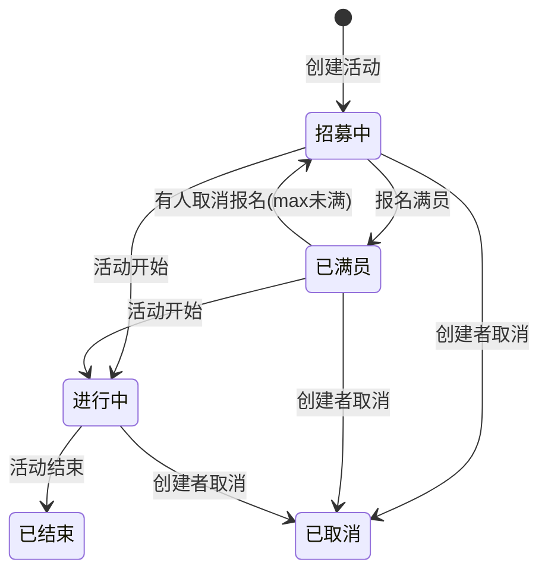
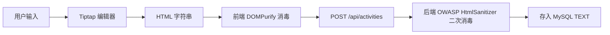
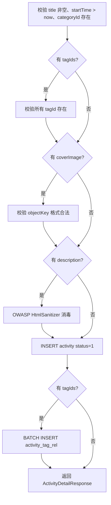
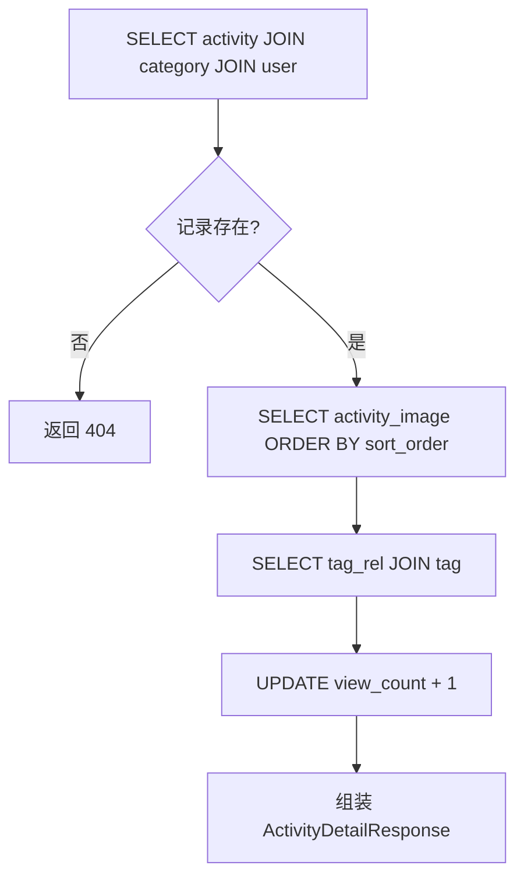
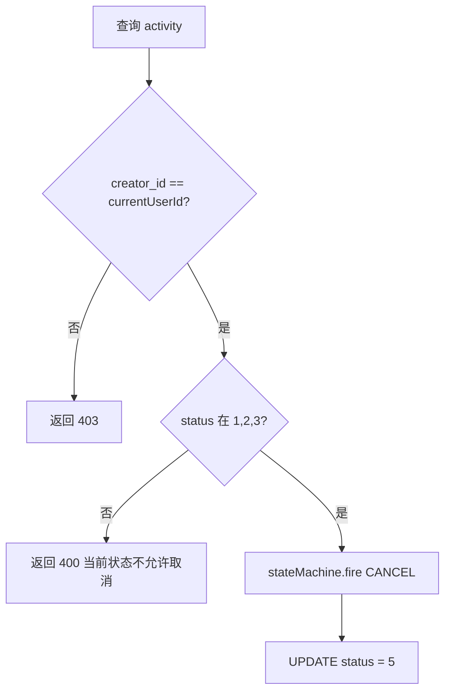
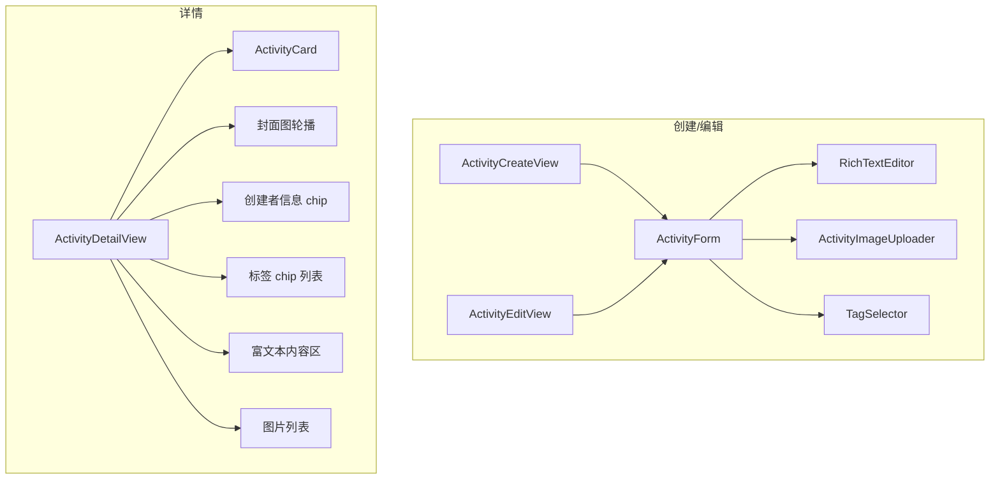

# 活动模块（Activity Module）设计文档

[toc]

## 概述

活动模块是 JustGo 的核心业务模块，负责活动的发布、浏览、搜索和管理。用户可以创建活动、按分类/标签/位置浏览活动、查看活动详情。分类和标签由管理员统一管理。

## 涉及文件

```
JustGo-backend/src/main/java/com/dyu/justgobackend/
├── controller/
│   ├── ActivityController.java              # 活动 REST 接口
│   └── CategoryController.java              # 分类 / 标签 REST 接口
├── service/
│   ├── ActivityService.java                 # 活动服务接口
│   ├── CategoryService.java                 # 分类服务接口
│   ├── activity/
│   │   └── ActivityContext.java             # 活动状态机 Guard 上下文
│   └── impl/
│       ├── ActivityServiceImpl.java         # 活动服务实现
│       └── CategoryServiceImpl.java         # 分类服务实现
├── entity/
│   ├── activity/
│   │   ├── Activity.java                    # 活动实体
│   │   ├── ActivityCategory.java            # 分类实体
│   │   ├── ActivityImage.java               # 活动图片实体
│   │   ├── ActivityTag.java                 # 标签实体
│   │   └── ActivityTagRel.java              # 活动-标签关联实体
│   └── user/
│       └── User.java                        # 用户实体（引用）
├── mapper/
│   ├── activity/
│   │   ├── ActivityMapper.java              # 活动 Mapper
│   │   ├── ActivityCategoryMapper.java      # 分类 Mapper
│   │   ├── ActivityImageMapper.java         # 图片 Mapper
│   │   ├── ActivityTagMapper.java           # 标签 Mapper
│   │   └── ActivityTagRelMapper.java        # 关联 Mapper
│   └── user/
│       └── UserMapper.java                  # 用户 Mapper（引用）
├── dto/request/
│   ├── activity/
│   │   ├── CreateActivityRequest.java       # 创建活动请求
│   │   ├── UpdateActivityRequest.java       # 更新活动请求
│   │   ├── ActivityPageQuery.java           # 活动列表查询参数
│   │   └── AddActivityImageRequest.java     # 添加图片请求
│   ├── auth/                                # 认证 DTO
│   └── user/                                # 用户 DTO
├── dto/response/
│   ├── activity/
│   │   ├── ActivityDetailResponse.java      # 活动详情响应
│   │   ├── ActivityListItemResponse.java    # 活动列表项响应
│   │   ├── ActivityPageResponse.java        # 分页响应
│   │   ├── CategoryResponse.java            # 分类响应
│   │   └── TagResponse.java                 # 标签响应
│   ├── auth/                                # 认证 DTO
│   └── user/                                # 用户 DTO
├── enums/
│   ├── ActivityStatus.java                  # 活动状态枚举
│   └── ActivityEvent.java                   # 活动事件枚举
├── config/
│   └── ActivityStateMachineConfig.java      # 活动状态机 Bean 定义
└── scheduler/
    └── ActivityStatusScheduler.java         # 状态自动流转定时任务

JustGo-backend/src/main/resources/
├── SQL/activity.sql                         # 建表 DDL
├── mapper/
│   ├── ActivityMapper.xml                   # 活动查询 XML
│   ├── ActivityImageMapper.xml              # 图片查询 XML
│   └── ActivityTagRelMapper.xml             # 关联查询 XML
└── db/data.sql                              # 分类 + 标签初始数据

JustGo-frontend/src/
├── api/
│   ├── activity.ts                          # 活动 API
│   └── category.ts                          # 分类/标签 API
├── types/api.ts                             # 新增活动相关 DTO 类型
├── router/index.ts                          # 新增活动路由
├── views/
│   ├── ActivityDetailView.vue               # 活动详情页
│   ├── ActivityCreateView.vue               # 创建活动页
│   └── ActivityEditView.vue                 # 编辑活动页
├── components/
│   ├── ActivityCard.vue                     # 重构：从硬编码改为真实数据
│   ├── ActivityForm.vue                     # 活动表单（创建/编辑共用）
│   ├── ActivityImageUploader.vue            # 活动图片上传组件
│   └── RichTextEditor.vue                   # 富文本编辑器（Tiptap 封装）
└── stores/
    └── category.ts                          # 分类/标签缓存（可选）
```

---

## 数据库设计

### 活动分类表 `activity_category`

```sql
CREATE TABLE activity_category (
    id BIGINT UNSIGNED NOT NULL AUTO_INCREMENT COMMENT '分类ID',
    name VARCHAR(30) NOT NULL COMMENT '分类名称',
    icon VARCHAR(50) DEFAULT NULL COMMENT '图标标识（emoji/icon名称）',
    sort_order INT UNSIGNED NOT NULL DEFAULT 0 COMMENT '排序（越小越前）',
    created_at DATETIME NOT NULL DEFAULT CURRENT_TIMESTAMP COMMENT '创建时间',
    PRIMARY KEY (id),
    UNIQUE KEY uk_name (name)
) ENGINE=InnoDB DEFAULT CHARSET=utf8mb4 COLLATE=utf8mb4_unicode_ci COMMENT='活动分类';
```

### 活动标签表 `activity_tag`

```sql
CREATE TABLE activity_tag (
    id BIGINT UNSIGNED NOT NULL AUTO_INCREMENT COMMENT '标签ID',
    name VARCHAR(30) NOT NULL COMMENT '标签名称',
    created_at DATETIME NOT NULL DEFAULT CURRENT_TIMESTAMP COMMENT '创建时间',
    PRIMARY KEY (id),
    UNIQUE KEY uk_name (name)
) ENGINE=InnoDB DEFAULT CHARSET=utf8mb4 COLLATE=utf8mb4_unicode_ci COMMENT='活动标签';
```

### 活动表 `activity`

```sql
CREATE TABLE activity (
    id BIGINT UNSIGNED NOT NULL AUTO_INCREMENT COMMENT '活动ID',
    creator_id BIGINT UNSIGNED NOT NULL COMMENT '发起人用户ID',
    category_id BIGINT UNSIGNED NOT NULL COMMENT '分类ID',
    title VARCHAR(100) NOT NULL COMMENT '活动标题',
    description TEXT COMMENT '活动描述（富文本HTML）',
    cover_image VARCHAR(500) DEFAULT NULL COMMENT '封面图URL（OSS objectKey）',
    location_name VARCHAR(200) NOT NULL COMMENT '地点名称（显示用）',
    latitude DECIMAL(10, 7) DEFAULT NULL COMMENT '纬度',
    longitude DECIMAL(10, 7) DEFAULT NULL COMMENT '经度',
    address VARCHAR(300) DEFAULT NULL COMMENT '详细地址',
    start_time DATETIME NOT NULL COMMENT '开始时间',
    end_time DATETIME DEFAULT NULL COMMENT '结束时间（可空=无固定结束时间）',
    max_participants INT UNSIGNED NOT NULL DEFAULT 0 COMMENT '人数上限（0=不限）',
    current_participants INT UNSIGNED NOT NULL DEFAULT 0 COMMENT '当前报名人数（冗余计数）',
    status TINYINT NOT NULL DEFAULT 1 COMMENT '状态：1=招募中 2=已满员 3=进行中 4=已结束 5=已取消',
    is_featured TINYINT NOT NULL DEFAULT 0 COMMENT '是否精选',
    view_count BIGINT UNSIGNED NOT NULL DEFAULT 0 COMMENT '浏览量',
    created_at DATETIME NOT NULL DEFAULT CURRENT_TIMESTAMP COMMENT '创建时间',
    updated_at DATETIME NOT NULL DEFAULT CURRENT_TIMESTAMP ON UPDATE CURRENT_TIMESTAMP COMMENT '更新时间',
    deleted_at DATETIME DEFAULT NULL COMMENT '删除时间（软删除）',
    PRIMARY KEY (id),
    KEY idx_category_status_time (category_id, status, start_time),
    KEY idx_creator (creator_id),
    KEY idx_start_time (start_time),
    KEY idx_featured (is_featured, start_time),
    KEY idx_deleted_at (deleted_at),
    CONSTRAINT fk_activity_creator FOREIGN KEY (creator_id) REFERENCES `user` (id),
    CONSTRAINT fk_activity_category FOREIGN KEY (category_id) REFERENCES activity_category (id)
) ENGINE=InnoDB DEFAULT CHARSET=utf8mb4 COLLATE=utf8mb4_unicode_ci COMMENT='活动';
```

> **关于地理位置索引**：`latitude` 和 `longitude` 字段在 Phase 1.1 先不加空间索引。Phase 1.2 地图集成时再补 `POINT` 列 + `SPATIAL INDEX`，现阶段活动列表按时间排序即可。

### 活动图片表 `activity_image`

```sql
CREATE TABLE activity_image (
    id BIGINT UNSIGNED NOT NULL AUTO_INCREMENT COMMENT '图片ID',
    activity_id BIGINT UNSIGNED NOT NULL COMMENT '活动ID',
    url VARCHAR(500) NOT NULL COMMENT '图片URL（OSS objectKey）',
    sort_order INT UNSIGNED NOT NULL DEFAULT 0 COMMENT '排序',
    created_at DATETIME NOT NULL DEFAULT CURRENT_TIMESTAMP COMMENT '创建时间',
    PRIMARY KEY (id),
    KEY idx_activity_sort (activity_id, sort_order),
    CONSTRAINT fk_image_activity FOREIGN KEY (activity_id) REFERENCES activity (id)
) ENGINE=InnoDB DEFAULT CHARSET=utf8mb4 COLLATE=utf8mb4_unicode_ci COMMENT='活动图片';
```

### 活动-标签关联表 `activity_tag_rel`

```sql
CREATE TABLE activity_tag_rel (
    activity_id BIGINT UNSIGNED NOT NULL COMMENT '活动ID',
    tag_id BIGINT UNSIGNED NOT NULL COMMENT '标签ID',
    PRIMARY KEY (activity_id, tag_id),
    CONSTRAINT fk_tag_rel_activity FOREIGN KEY (activity_id) REFERENCES activity (id),
    CONSTRAINT fk_tag_rel_tag FOREIGN KEY (tag_id) REFERENCES activity_tag (id)
) ENGINE=InnoDB DEFAULT CHARSET=utf8mb4 COLLATE=utf8mb4_unicode_ci COMMENT='活动-标签关联';
```

---

## 活动状态流转



**状态变更触发点**：

| 触发 | 逻辑 |
|------|------|
| 创建活动 | `status = 1`（招募中） |
| 取消活动 | `status = 5`（已取消），creator 手动触发 |
| 报名满员 | `status = 2`（已满员），`current_participants >= max_participants` 时 |
| 活动开始 | `status = 3`（进行中），定时任务检查 `start_time <= NOW()` |
| 活动结束 | `status = 4`（已结束），定时任务检查 `end_time <= NOW()` |
| 取消报名 | 若 `current_participants < max_participants` 且 `status = 2`，恢复 `status = 1` |

> Phase 1.1 MVP：**状态由显式操作触发**（创建=1，取消=5）。满员检查在报名时判断。`进行中`/`已结束` 的自动流转通过定时任务（`@Scheduled` 每 5 分钟）完成。

---

## API 端点

### 活动 CRUD

| 方法 | 路径 | 认证 | 说明 |
|------|------|------|------|
| `POST` | `/api/activities` | 是 | 创建活动 |
| `GET` | `/api/activities` | 是 | 活动列表（分页+筛选） |
| `GET` | `/api/activities/{id}` | 是 | 活动详情 |
| `PUT` | `/api/activities/{id}` | 是 | 更新活动（仅创建者） |
| `PATCH` | `/api/activities/{id}/cancel` | 是 | 取消活动（仅创建者） |
| `GET` | `/api/activities/{id}/images` | 是 | 获取活动图片列表 |
| `POST` | `/api/activities/{id}/images` | 是 | 添加图片（保存 OSS objectKey） |
| `DELETE` | `/api/activities/{id}/images/{imageId}` | 是 | 删除图片（仅创建者） |

### 分类与标签

| 方法 | 路径 | 认证 | 说明 |
|------|------|------|------|
| `GET` | `/api/categories` | 是 | 分类列表 |
| `GET` | `/api/tags` | 是 | 标签列表 |
| `POST` | `/api/admin/categories` | 是+管理员 | 创建分类 |
| `PUT` | `/api/admin/categories/{id}` | 是+管理员 | 更新分类 |
| `DELETE` | `/api/admin/categories/{id}` | 是+管理员 | 删除分类 |
| `POST` | `/api/admin/tags` | 是+管理员 | 创建标签 |
| `PUT` | `/api/admin/tags/{id}` | 是+管理员 | 更新标签 |
| `DELETE` | `/api/admin/tags/{id}` | 是+管理员 | 删除标签 |

---

## Request / Response DTO 定义

### 创建活动

```java
// CreateActivityRequest.java
public record CreateActivityRequest(
    @NotBlank @Size(max = 100) String title,
    @Size(max = 10000) String description,       // 富文本 HTML
    @NotNull @Positive Long categoryId,
    @NotBlank @Size(max = 200) String locationName,
    @DecimalMin("-90") @DecimalMax("90") BigDecimal latitude,
    @DecimalMin("-180") @DecimalMax("180") BigDecimal longitude,
    @Size(max = 300) String address,
    @NotNull @Future LocalDateTime startTime,
    @Future LocalDateTime endTime,
    @Positive @Max(99999) Integer maxParticipants,  // 0=不限
    @Size(max = 20) List<@Positive Long> tagIds,
    @Size(max = 500) String coverImage               // OSS objectKey
) {}
```

### 更新活动

```java
// UpdateActivityRequest.java — 所有字段可选
public record UpdateActivityRequest(
    @Size(max = 100) String title,
    @Size(max = 10000) String description,
    @Positive Long categoryId,
    @Size(max = 200) String locationName,
    @DecimalMin("-90") @DecimalMax("90") BigDecimal latitude,
    @DecimalMin("-180") @DecimalMax("180") BigDecimal longitude,
    @Size(max = 300) String address,
    @Future LocalDateTime startTime,
    @Future LocalDateTime endTime,
    @Positive @Max(99999) Integer maxParticipants,
    @Size(max = 20) List<@Positive Long> tagIds,
    @Size(max = 500) String coverImage
) {}
```

### 活动列表查询

```java
// ActivityPageQuery.java
public record ActivityPageQuery(
    @Positive Long categoryId,
    @Positive Integer status,           // ActivityStatus 枚举值
    @Size(max = 100) String keyword,    // 标题关键词搜索
    @Min(1) @Max(50) int size,
    @Min(1) int page
) {
    public ActivityPageQuery {
        if (size == 0) size = 20;
        if (page == 0) page = 1;
    }
}
```

### 活动列表项响应

```java
// ActivityListItemResponse.java
public record ActivityListItemResponse(
    Long id,
    String title,
    String coverImage,          // 封面图 URL
    String locationName,
    LocalDateTime startTime,
    LocalDateTime endTime,
    Integer maxParticipants,
    Integer currentParticipants,
    Integer status,
    Long categoryId,
    String categoryName,
    List<String> tags,          // 标签名列表
    CreatorInfo creator,        // 创建者简要信息
    LocalDateTime createdAt
) {
    public record CreatorInfo(Long id, String nickname, String avatar) {}
}
```

### 活动详情响应

```java
// ActivityDetailResponse.java
public record ActivityDetailResponse(
    Long id,
    String title,
    String description,           // 富文本 HTML（已消毒）
    String coverImage,
    String locationName,
    BigDecimal latitude,
    BigDecimal longitude,
    String address,
    LocalDateTime startTime,
    LocalDateTime endTime,
    Integer maxParticipants,
    Integer currentParticipants,
    Integer status,
    Long categoryId,
    String categoryName,
    List<ImageInfo> images,       // 图片列表
    List<String> tags,
    CreatorInfo creator,
    Long viewCount,
    LocalDateTime createdAt,
    LocalDateTime updatedAt
) {
    public record ImageInfo(Long id, String url, Integer sortOrder) {}
    public record CreatorInfo(Long id, String nickname, String avatar) {}
}
```

### 分类 / 标签响应

```java
public record CategoryResponse(Long id, String name, String icon, Integer sortOrder) {}
public record TagResponse(Long id, String name) {}
```

---

## 实现细节

### 1. 富文本处理策略

**编辑器选型**：Tiptap（基于 ProseMirror），Vue 3 原生支持，TypeScript 友好，轻量可扩展。



**安全措施**：
- 前端：`dompurify` 库，白名单模式，仅允许安全标签和属性
- 后端：引入 `com.googlecode.owasp-java-html-sanitizer`，二次消毒防绕过
- 展示端：`v-html` 渲染已消毒内容（不再做额外处理，因已双重消毒）

**允许的 HTML 标签**（白名单）：`p, br, strong, em, u, s, h2, h3, ul, ol, li, a[href,target], img[src,alt], blockquote`

### 2. 活动创建流程



### 3. 活动列表查询

- **分页**：手动 LIMIT/OFFSET 分页（MyBatis-Plus 3.5.16 中 `PaginationInnerInterceptor` 不存在），size 上限 50
- **筛选**：`categoryId` 精确匹配、`status` 精确匹配、`keyword` 对 `title` 做 `LIKE '%keyword%'`
- **排序**：默认按 `start_time ASC`（即将开始优先），可选 `created_at DESC`（最新）
- **软删除**：MyBatis-Plus `logic-delete-field: deletedAt` 自动过滤
- **批量查询优化**：列表查询时用 JOIN 获取分类名和创建者信息，标签列表通过 Java 层批量查询 `activity_tag_rel` 避免 N+1

```sql
-- 活动列表 SQL 草图
SELECT a.*, ac.name AS category_name, u.nickname, u.avatar
FROM activity a
JOIN activity_category ac ON a.category_id = ac.id
JOIN `user` u ON a.creator_id = u.id
WHERE a.deleted_at IS NULL
  AND a.category_id = #{categoryId}        -- 可选
  AND a.status = #{status}                 -- 可选
  AND a.title LIKE CONCAT('%', #{keyword}, '%')  -- 可选
ORDER BY a.start_time ASC
LIMIT #{offset}, #{size}
```

> 标签列表在 Java 层批量查询：收集当前页所有 activityId → `SELECT * FROM activity_tag_rel WHERE activity_id IN (...)` → 组装到各 item。

### 4. 活动详情查询



> 浏览量递增用 `UPDATE ... SET view_count = view_count + 1`，无竞态问题（MySQL 行级锁保证原子性）。

### 5. 活动取消



### 6. 图片管理

- 图片上传沿用现有 OSS 预签名 URL 流程：前端调 `/api/files/upload-token` 获取签名 URL → 直传 OSS → 拿到 objectKey → 调 `POST /api/activities/{id}/images` 保存 objectKey
- 每活动最多 9 张图片（后端校验）
- `sort_order` 按添加顺序自动递增
- 删除图片：校验 `activity.creator_id == currentUserId`，DELETE 记录

### 7. 分类/标签管理

- **分类和标签列表缓存** Redis（TTL 1h），创建/更新/删除时主动失效
- 删除分类前校验：是否有活动关联此分类？如有则拒绝删除，返回 "该分类下有 N 个活动，无法删除"
- 标签无此限制（标签可任意增删，关联表有 ON DELETE CASCADE 约束，但这里不用外键级联，用应用层处理）

> 修正：`activity_tag_rel` 外键不使用 CASCADE，改为应用层删除。删除标签时手动清理关联表。

### 8. 定时任务：状态自动流转

```java
@Component
public class ActivityStatusScheduler {

    private final ActivityMapper activityMapper;

    @Scheduled(cron = "0 */5 * * * ?")  // 每5分钟
    public void advanceStatus() {
        LocalDateTime now = LocalDateTime.now();

        // 招募中/已满员 → 进行中：start_time <= NOW()
        int started = activityMapper.updateStatusByTime(
            List.of(ActivityStatus.RECRUITING.code(), ActivityStatus.FULL.code()),
            ActivityStatus.ONGOING.code(), now);

        // 进行中 → 已结束：end_time <= NOW() (end_time 不为 NULL)
        int ended = activityMapper.updateEndedStatus(
            ActivityStatus.ONGOING.code(), ActivityStatus.ENDED.code(), now);
    }
}
```

> 定时任务走批量 SQL，绕过 StateMachine。StateMachine 仅在 Service 层处理单个用户操作时使用。
```

---

## 已解决的问题

| 问题 | 方案 |
|------|------|
| 富文本 XSS 风险 | 前端 DOMPurify + 后端 OWASP HtmlSanitizer 双重消毒 |
| 人数超限 | 报名时原子 UPDATE 校验 `current_participants < max_participants` |
| 活动状态一致性 | 关键状态由显式操作触发 + 定时任务兜底自动流转 |
| 图片上传安全 | 复用现有 OSS 预签名 URL 机制，objectKey 用 UUID 防遍历 |
| 标签 N+1 查询 | 批量查询 activity_tag_rel，一次 IN 查询组装 |
| 分类/标签列表性能 | Redis 缓存，TTL 1h |

---

## 未解决的问题与隐患

### 重要（P1）

#### 1. 定时任务单点

`ActivityStatusScheduler` 无分布式锁，多实例部署时重复执行。虽然 `UPDATE` 本身幂等，但会产生无意义的 DB 写入。

**建议**：引入 Redis `SETNX` 分布式锁，或使用 `@SchedulerLock`（ShedLock）。

#### 2. 富文本图片引用可能失效

用户粘贴的外部图片链接可能失效；Tiptap 中上传的图片需要先走 OSS 上传流程。

**建议**：Tiptap 的图片插件配置为仅接受 OSS 上传，禁止粘贴外部 URL。

#### 3. 浏览量计数无防刷

每次访问详情页 `view_count + 1`，无去重机制。可被脚本刷量。

**建议**：Phase 2 引入 Redis HyperLogLog 或布隆过滤器按 (activityId, userId/IP) 去重。

### 一般（P2）

#### 4. 删除分类未处理关联活动的展示

如果分类下有活动，删除分类后活动详情中 `categoryName` 需 JOIN 查不到。当前设计拒绝删除有关联活动的分类，暂可接受。

#### 5. 手动分页替代 MyBatis-Plus Page

MyBatis-Plus 3.5.16 中 `PaginationInnerInterceptor` 类不存在，无法使用 `Page<T>` 自动分页。当前采用手动 LIMIT/OFFSET + COUNT 两查询方案，后续若升级 MyBatis-Plus 版本可切换。

#### 6. 活动列表默认排序单一

当前仅按 `start_time ASC` 排序，后续需支持按距离、热度等多维排序（Phase 1.2 + Phase 3）。

---

## 大厂标准对比

| 维度 | 现状 | 大厂标准 | 差距 |
|------|------|------|------|
| 富文本安全 | 双重消毒 | 三重消毒（前端+后端+CDN） | 低 |
| 并发报名 | 原子 UPDATE | 原子 UPDATE + 队列削峰 | 低（MVP 够用） |
| 活动搜索 | MySQL LIKE | Elasticsearch 全文搜索 | 高（Phase 2.4） |
| 内容审核 | 无 | AI + 人工审核 | 高（Phase 3.2） |
| 地理位置查询 | MySQL LIKE/Haversine | PostGIS / MongoDB GeoJSON | 高（Phase 1.2） |
| 缓存策略 | Redis 分类/标签缓存 | 多级缓存 + 缓存预热 | 中 |
| 活动推荐 | 无 | 协同过滤 / 深度学习 | 高（Phase 3.3） |

---

## 高可用 & 高并发分析

### 当前瓶颈

| 组件 | 问题 | 影响 |
|------|------|------|
| 活动列表查询 | JOIN 多表，LIKE 搜索 | 数据量大时慢查询 |
| 报名并发 | `current_participants` 行级锁竞争 | 热点活动报名时短暂阻塞 |
| 浏览量更新 | 每次详情页访问写 DB | 热门活动高频 UPDATE |

### 规模化方案

1. **活动列表**：分类 + 热门活动缓存到 Redis（TTL 5min），减少 JOIN 查询
2. **报名削峰**：热点活动报名用 Redis 队列缓冲，异步写入 DB（Phase 2）
3. **浏览量**：Redis INCR 聚合，定时批量刷 DB（Phase 2）
4. **搜索**：MySQL FULLTEXT → Elasticsearch（Phase 2.4）

---

## 前端路由与页面

| 路由 | 页面 | 说明 |
|------|------|------|
| `/activities/create` | `ActivityCreateView.vue` | 创建活动 |
| `/activities/:id` | `ActivityDetailView.vue` | 活动详情 |
| `/activities/:id/edit` | `ActivityEditView.vue` | 编辑活动（仅创建者可见） |

### 组件树



### HomeView 改造

`HomeView.vue` 中的 `ActivityCard` 从硬编码 mock 数据改为从 `/api/activities` 获取真实数据：
- 分类 tabs 从 `/api/categories` 加载
- 活动列表从 `/api/activities` 分页加载
- 添加 loading 骨架屏、empty 空态、error 重试

---

## 初始化数据

### 分类预设

```sql
INSERT INTO activity_category (name, icon, sort_order) VALUES
('展览', '🎨', 1),
('运动', '⚽', 2),
('市集', '🎪', 3),
('音乐', '🎵', 4),
('美食', '🍜', 5),
('户外', '🏕️', 6),
('桌游', '🎲', 7),
('观影', '🎬', 8),
('学习', '📚', 9),
('其他', '✨', 99);
```

### 标签预设

```sql
INSERT INTO activity_tag (name) VALUES
('周末'), ('免费'), ('亲子'), ('宠物友好'),
('新手友好'), ('摄影'), ('社交'), ('治愈'),
('高强度'), ('轻松'), ('室内'), ('室外'),
('限时'), ('长期'), ('线上');
```

---

## 验证清单

开发完成后逐项验证：

- [x] `mvn test` 全部通过（16 tests）
- [ ] 创建活动 happy path（含标签、封面图）
- [ ] 活动列表按分类筛选 + 关键词搜索
- [ ] 活动详情含图片列表、标签、创建者信息
- [ ] 更新活动（仅创建者可操作）
- [ ] 取消活动（已结束/已取消不可再取消）
- [ ] 上传/删除活动图片（仅创建者可删）
- [ ] 分类列表/标签列表接口
- [ ] 管理员创建/更新/删除分类和标签
- [ ] 富文本 XSS 消毒验证（提交含 script 标签的 HTML）
- [ ] 前端 `npm run build` 类型检查通过
- [ ] 移动端视图走查所有新页面
- [ ] 活动卡片 loading / empty / error 三态
