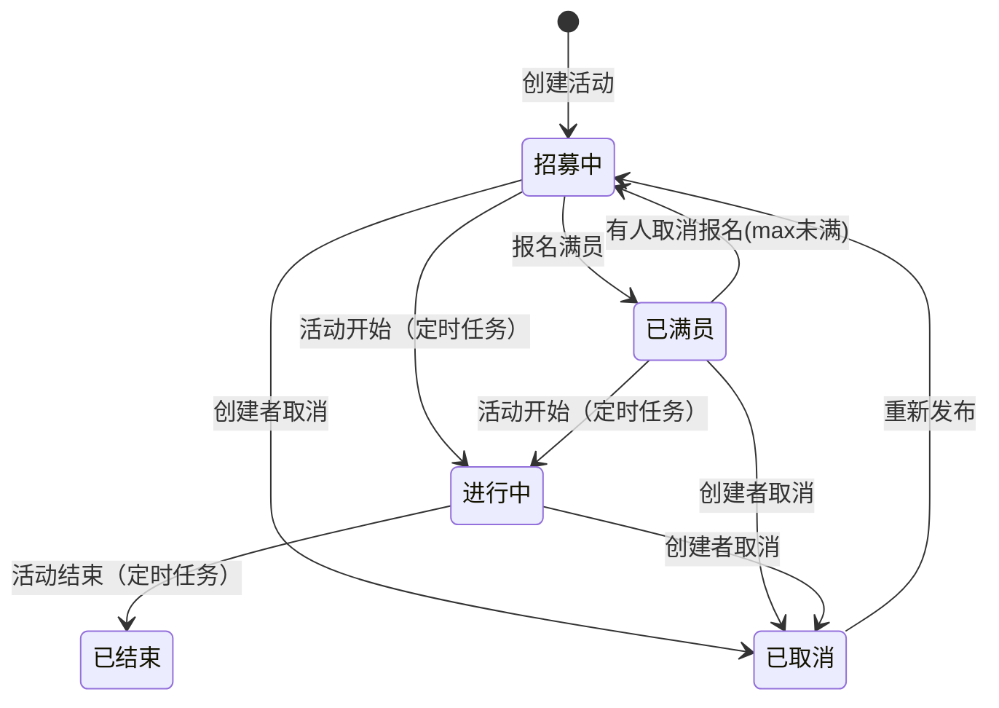

# 活动模块（Activity Module）设计文档

[toc]

## 概述

活动模块是 JustGo 的核心业务模块，负责活动的发布、浏览、参与和管理。用户可以创建活动、按分类/标签浏览活动、查看活动详情、报名/取消报名。分类和标签由管理员统一管理。

## 涉及文件

```
JustGo-backend/src/main/java/com/dyu/justgobackend/
├── controller/
│   ├── ActivityController.java              # 活动 REST 接口
│   └── CategoryController.java              # 分类 / 标签 REST 接口
├── service/
│   ├── ActivityService.java                 # 活动服务接口
│   ├── CategoryService.java                 # 分类服务接口
│   ├── activity/
│   │   └── ActivityContext.java             # 活动状态机 Guard 上下文
│   └── impl/
│       ├── ActivityServiceImpl.java         # 活动服务实现
│       └── CategoryServiceImpl.java         # 分类服务实现
├── entity/
│   ├── activity/
│   │   ├── Activity.java                    # 活动实体
│   │   ├── ActivityCategory.java            # 分类实体
│   │   ├── ActivityImage.java               # 活动图片实体
│   │   ├── ActivityTag.java                 # 标签实体
│   │   ├── ActivityTagRel.java              # 活动-标签关联实体
│   │   └── ActivityParticipant.java         # 活动参与记录实体
│   └── user/
│       └── User.java                        # 用户实体（引用）
├── mapper/
│   ├── activity/
│   │   ├── ActivityMapper.java              # 活动 Mapper
│   │   ├── ActivityCategoryMapper.java      # 分类 Mapper
│   │   ├── ActivityImageMapper.java         # 图片 Mapper
│   │   ├── ActivityTagMapper.java           # 标签 Mapper
│   │   ├── ActivityTagRelMapper.java        # 标签关联 Mapper
│   │   └── ActivityParticipantMapper.java   # 参与记录 Mapper
│   └── user/
│       └── UserMapper.java                  # 用户 Mapper（引用）
├── dto/request/
│   ├── activity/
│   │   ├── CreateActivityRequest.java       # 创建活动请求
│   │   ├── UpdateActivityRequest.java       # 更新活动请求
│   │   ├── ActivityPageQuery.java           # 活动列表查询参数
│   │   └── AddActivityImageRequest.java     # 添加图片请求
│   ├── auth/                                # 认证 DTO
│   └── user/                                # 用户 DTO
├── dto/response/
│   ├── activity/
│   │   ├── ActivityDetailResponse.java      # 活动详情响应
│   │   ├── ActivityListItemResponse.java    # 活动列表项响应
│   │   ├── ActivityPageResponse.java        # 分页响应
│   │   ├── CategoryResponse.java            # 分类响应
│   │   └── TagResponse.java                 # 标签响应
│   ├── auth/                                # 认证 DTO
│   └── user/                                # 用户 DTO
├── enums/
│   ├── ActivityStatus.java                  # 活动状态枚举
│   └── ActivityEvent.java                   # 活动事件枚举
├── config/
│   └── ActivityStateMachineConfig.java      # 活动状态机 Bean 定义
└── scheduler/
    └── ActivityStatusScheduler.java         # 状态自动流转定时任务

JustGo-backend/src/main/resources/
├── SQL/activity.sql                         # 建表 DDL
├── mapper/
│   ├── ActivityMapper.xml                   # 活动查询 XML
│   ├── ActivityImageMapper.xml              # 图片查询 XML
│   ├── ActivityTagRelMapper.xml             # 标签关联查询 XML
│   └── ActivityParticipantMapper.xml        # 参与记录查询 XML

JustGo-frontend/src/
├── api/
│   ├── activity.ts                          # 活动 API
│   └── category.ts                          # 分类/标签 API
├── types/api.ts                             # 活动相关 DTO 类型 + 状态常量
├── router/index.ts                          # 活动路由
├── views/
│   ├── ActivityDetailView.vue               # 活动详情页（含报名/取消/重新发布）
│   ├── ActivityCreateView.vue               # 创建活动页
│   ├── ActivityEditView.vue                 # 编辑活动页
│   └── ProfileView.vue                      # 个人主页（发起的/参与的活动 Tab）
├── components/
│   ├── ActivityCard.vue                     # 活动卡片（真实数据类型）
│   ├── ActivityForm.vue                     # 活动表单（创建/编辑共用）
│   ├── ActivityImageUploader.vue            # 图片上传 + 裁剪
│   ├── ImageCropper.vue                     # 图片裁剪弹窗（cropperjs）
│   └── RichTextEditor.vue                   # 富文本编辑器（Tiptap）
```

---

## 数据库设计

### 活动分类表 `activity_category`

```sql
CREATE TABLE activity_category (
    id BIGINT UNSIGNED NOT NULL AUTO_INCREMENT COMMENT '分类ID',
    name VARCHAR(30) NOT NULL COMMENT '分类名称',
    icon VARCHAR(50) DEFAULT NULL COMMENT '图标标识',
    sort_order INT UNSIGNED NOT NULL DEFAULT 0 COMMENT '排序',
    created_at DATETIME NOT NULL DEFAULT CURRENT_TIMESTAMP,
    PRIMARY KEY (id),
    UNIQUE KEY uk_name (name)
) ENGINE=InnoDB DEFAULT CHARSET=utf8mb4 COLLATE=utf8mb4_unicode_ci;
```

### 活动标签表 `activity_tag`

```sql
CREATE TABLE activity_tag (
    id BIGINT UNSIGNED NOT NULL AUTO_INCREMENT COMMENT '标签ID',
    name VARCHAR(30) NOT NULL COMMENT '标签名称',
    created_at DATETIME NOT NULL DEFAULT CURRENT_TIMESTAMP,
    PRIMARY KEY (id),
    UNIQUE KEY uk_name (name)
) ENGINE=InnoDB DEFAULT CHARSET=utf8mb4 COLLATE=utf8mb4_unicode_ci;
```

### 活动表 `activity`

```sql
CREATE TABLE activity (
    id BIGINT UNSIGNED NOT NULL AUTO_INCREMENT,
    creator_id BIGINT UNSIGNED NOT NULL,
    category_id BIGINT UNSIGNED NOT NULL,
    title VARCHAR(100) NOT NULL,
    description TEXT COMMENT '富文本 HTML',
    cover_image VARCHAR(500) DEFAULT NULL COMMENT '封面图 OSS objectKey',
    location_name VARCHAR(200) NOT NULL,
    latitude DECIMAL(10, 7) DEFAULT NULL,
    longitude DECIMAL(10, 7) DEFAULT NULL,
    address VARCHAR(300) DEFAULT NULL,
    start_time DATETIME NOT NULL,
    end_time DATETIME DEFAULT NULL,
    max_participants INT UNSIGNED NOT NULL DEFAULT 0 COMMENT '0=不限',
    current_participants INT UNSIGNED NOT NULL DEFAULT 0 COMMENT '冗余计数',
    status TINYINT NOT NULL DEFAULT 1 COMMENT '1=招募中 2=已满员 3=进行中 4=已结束 5=已取消',
    is_featured TINYINT NOT NULL DEFAULT 0,
    view_count BIGINT UNSIGNED NOT NULL DEFAULT 0,
    created_at DATETIME NOT NULL DEFAULT CURRENT_TIMESTAMP,
    updated_at DATETIME NOT NULL DEFAULT CURRENT_TIMESTAMP ON UPDATE CURRENT_TIMESTAMP,
    deleted_at DATETIME DEFAULT NULL,
    PRIMARY KEY (id),
    KEY idx_category_status_time (category_id, status, start_time),
    KEY idx_creator (creator_id),
    KEY idx_start_time (start_time),
    CONSTRAINT fk_activity_creator FOREIGN KEY (creator_id) REFERENCES `user` (id),
    CONSTRAINT fk_activity_category FOREIGN KEY (category_id) REFERENCES activity_category (id)
) ENGINE=InnoDB DEFAULT CHARSET=utf8mb4 COLLATE=utf8mb4_unicode_ci;
```

### 活动图片表 `activity_image`

```sql
CREATE TABLE activity_image (
    id BIGINT UNSIGNED NOT NULL AUTO_INCREMENT,
    activity_id BIGINT UNSIGNED NOT NULL,
    url VARCHAR(500) NOT NULL COMMENT 'OSS objectKey',
    sort_order INT UNSIGNED NOT NULL DEFAULT 0,
    created_at DATETIME NOT NULL DEFAULT CURRENT_TIMESTAMP,
    PRIMARY KEY (id),
    KEY idx_activity_sort (activity_id, sort_order),
    CONSTRAINT fk_image_activity FOREIGN KEY (activity_id) REFERENCES activity (id)
) ENGINE=InnoDB DEFAULT CHARSET=utf8mb4 COLLATE=utf8mb4_unicode_ci;
```

### 活动-标签关联表 `activity_tag_rel`

```sql
CREATE TABLE activity_tag_rel (
    activity_id BIGINT UNSIGNED NOT NULL,
    tag_id BIGINT UNSIGNED NOT NULL,
    PRIMARY KEY (activity_id, tag_id),
    CONSTRAINT fk_tag_rel_activity FOREIGN KEY (activity_id) REFERENCES activity (id),
    CONSTRAINT fk_tag_rel_tag FOREIGN KEY (tag_id) REFERENCES activity_tag (id)
) ENGINE=InnoDB DEFAULT CHARSET=utf8mb4 COLLATE=utf8mb4_unicode_ci;
```

### 活动参与记录表 `activity_participant`

```sql
CREATE TABLE activity_participant (
    id BIGINT UNSIGNED NOT NULL AUTO_INCREMENT,
    activity_id BIGINT UNSIGNED NOT NULL,
    user_id BIGINT UNSIGNED NOT NULL,
    created_at DATETIME NOT NULL DEFAULT CURRENT_TIMESTAMP COMMENT '报名时间',
    PRIMARY KEY (id),
    UNIQUE KEY uk_activity_user (activity_id, user_id),
    KEY idx_user (user_id),
    CONSTRAINT fk_participant_activity FOREIGN KEY (activity_id) REFERENCES activity (id),
    CONSTRAINT fk_participant_user FOREIGN KEY (user_id) REFERENCES `user` (id)
) ENGINE=InnoDB DEFAULT CHARSET=utf8mb4 COLLATE=utf8mb4_unicode_ci;
```

> `uk_activity_user` 唯一索引防止重复报名，`idx_user` 用于查询"我参与的活动"。

---

## 活动状态流转



### 状态变更触发点

| 触发 | 事件 | 状态变化 |
|------|------|------|
| 创建活动 | — | `status = 1`（招募中） |
| 报名 | JOIN | 满员→FULL，未满→保持 RECRUITING |
| 取消报名 | JOIN | 满员不满→回到 RECRUITING |
| 创建者取消 | CANCEL | → CANCELLED |
| 重新发布 | REPUBLISH | CANCELLED → RECRUITING |
| 定时任务 | START | RECRUITING / FULL → ONGOING |
| 定时任务 | END | ONGOING → ENDED |

> 状态机详细设计见 [state-machine.md](../common/state-machine.md)。定时任务走批量 SQL 绕过 StateMachine。

---

## API 端点

### 活动 CRUD

| 方法 | 路径 | 认证 | 说明 |
|------|------|------|------|
| `POST` | `/api/activities` | 是 | 创建活动 |
| `GET` | `/api/activities` | 是 | 活动列表（分页+筛选） |
| `GET` | `/api/activities/{id}` | 是 | 活动详情（含浏览量+1） |
| `PUT` | `/api/activities/{id}` | 是 | 更新活动（仅创建者） |
| `PATCH` | `/api/activities/{id}/cancel` | 是 | 取消活动（仅创建者） |
| `PATCH` | `/api/activities/{id}/republish` | 是 | 重新发布已取消的活动（仅创建者） |
| `GET` | `/api/activities/{id}/images` | 是 | 获取活动图片列表 |
| `POST` | `/api/activities/{id}/images` | 是 | 添加图片 |
| `DELETE` | `/api/activities/{id}/images/{imageId}` | 是 | 删除图片（仅创建者） |

### 活动参与

| 方法 | 路径 | 认证 | 说明 |
|------|------|------|------|
| `POST` | `/api/activities/{id}/join` | 是 | 报名参加活动 |
| `DELETE` | `/api/activities/{id}/join` | 是 | 取消报名 |
| `GET` | `/api/activities/{id}/joined` | 是 | 查询当前用户是否已报名 |
| `GET` | `/api/users/me/activities?type=created\|joined` | 是 | 我的活动（发起/参与） |

### 分类与标签

| 方法 | 路径 | 认证 | 说明 |
|------|------|------|------|
| `GET` | `/api/categories` | 是 | 分类列表 |
| `GET` | `/api/tags` | 是 | 标签列表 |
| `POST` | `/api/admin/categories` | 是+管理员 | 创建分类 |
| `PUT` | `/api/admin/categories/{id}` | 是+管理员 | 更新分类 |
| `DELETE` | `/api/admin/categories/{id}` | 是+管理员 | 删除分类 |
| `POST` | `/api/admin/tags` | 是+管理员 | 创建标签 |
| `PUT` | `/api/admin/tags/{id}` | 是+管理员 | 更新标签 |
| `DELETE` | `/api/admin/tags/{id}` | 是+管理员 | 删除标签 |

---

## DTO 定义

### ActivityListItemResponse（MyBatis 映射 → class 非 record）

```java
// 注意：MyBatis resultMap 映射类型不能用 record（构造器注入列错位），必须用普通类
public class ActivityListItemResponse {
    private Long id;
    private String title;
    private String coverImage;        // API 返回时为预签名 URL
    private String locationName;
    private LocalDateTime startTime;
    private LocalDateTime endTime;
    private Integer maxParticipants;
    private Integer currentParticipants;
    private Integer status;
    private Long categoryId;
    private String categoryName;
    private List<String> tags;        // Service 层批量查询后填充
    private CreatorInfo creator;      // <association> 映射
    private LocalDateTime createdAt;
    // getter / setter ...

    public static class CreatorInfo {
        private Long id;
        private String nickname;
        private String avatar;        // API 返回时为预签名 URL
        // getter / setter ...
    }
}
```

### ActivityDetailResponse（record，非 MyBatis 映射）

```java
public record ActivityDetailResponse(
    Long id, String title, String description, String coverImage,
    String locationName, BigDecimal latitude, BigDecimal longitude, String address,
    LocalDateTime startTime, LocalDateTime endTime,
    Integer maxParticipants, Integer currentParticipants, Integer status,
    Long categoryId, String categoryName,
    List<ImageInfo> images, List<String> tags, CreatorInfo creator,
    Long viewCount, LocalDateTime createdAt, LocalDateTime updatedAt
) {
    public record ImageInfo(Long id, String url, Integer sortOrder) {}
    public record CreatorInfo(Long id, String nickname, String avatar) {}
}
```

> `coverImage`、`ImageInfo.url`、`CreatorInfo.avatar` 在 Service 层通过 `OssService.generatePresignedGetUrl()` 解析为预签名 URL。纯本地计算，无网络开销。

---

## 实现细节

### 1. OSS URL 解析

DB 中存储的是 OSS objectKey（非可访问 URL），API 响应返回前统一调用 `toDisplayUrl()` 解析：

```java
private String toDisplayUrl(String value) {
    if (!StringUtils.hasText(value) || value.startsWith("http://") || value.startsWith("https://")) {
        return value;  // 已是完整 URL 则透传
    }
    return ossService.generatePresignedGetUrl(value);
}
```

覆盖范围：`ActivityListItemResponse.coverImage`、`ActivityListItemResponse.CreatorInfo.avatar`、`ActivityDetailResponse.coverImage`、`ActivityDetailResponse.CreatorInfo.avatar`、`ImageInfo.url`。

### 2. 报名并发安全

使用原子 UPDATE + 条件 SQL 防止超报：

```java
var updateWrapper = new LambdaUpdateWrapper<Activity>()
    .eq(Activity::getId, activityId)
    .setSql("current_participants = current_participants + 1")
    .apply("AND (max_participants = 0 OR current_participants < max_participants)");
int affected = activityMapper.update(null, updateWrapper);
if (affected == 0) throw new BusinessException(400, "活动已满员");
```

`uk_activity_user` 唯一索引防止重复报名。

### 3. 取消报名状态回退

取消报名后重新查询人数，通过状态机计算新状态（FULL + 不满 → RECRUITING）。

### 4. 活动列表批量查询优化

标签列表通过 Java 层批量查询避免 N+1：

```java
// 收集当前页 activityId 列表
List<Long> ids = items.stream().map(ActivityListItemResponse::getId).toList();
// 一次 IN 查询所有标签
Map<Long, List<String>> tagMap = tagRelMapper.selectTagNamesByActivityIds(ids);
```

### 5. 分类/标签缓存

Redis 缓存，TTL 1h。创建/更新/删除时主动失效。删除分类前校验关联活动数。

### 6. 定时任务：状态自动流转

```java
@Scheduled(cron = "0 */5 * * * ?")
public void advanceStatus() {
    // RECRUITING/FULL → ONGOING: start_time <= NOW()
    activityMapper.updateStatusByTime(fromStatuses, ONGOING.code(), now);
    // ONGOING → ENDED: end_time <= NOW()
    activityMapper.updateEndedStatus(ONGOING.code(), ENDED.code(), now);
}
```

### 7. 图片裁剪上传

前端选择图片后弹出 `ImageCropper` 弹窗（cropperjs），支持拖拽移动、缩放调整，裁剪框比例固定。确认后输出 JPEG Blob 直传 OSS。

### 8. 个人主页活动展示

`ProfileView.vue` 展示"发起的活动"和"参与的活动"两个 Tab，调用 `GET /api/users/me/activities?type=created|joined`，含三态（骨架屏/error重试/列表/空态）。

---

## 已解决的问题

| 问题 | 方案 |
|------|------|
| 富文本 XSS 风险 | 前端 DOMPurify + 后端 OWASP HtmlSanitizer 双重消毒 |
| 报名超限 | 原子 UPDATE + SQL 条件校验 |
| 重复报名 | `uk_activity_user` 唯一索引 |
| 活动状态一致性 | StateMachine + 定时任务兜底 |
| 标签 N+1 | 批量 IN 查询 |
| 分类/标签列表性能 | Redis 缓存 TTL 1h |
| OSS 图片无法展示 | Service 层 `toDisplayUrl()` 统一解析 objectKey → 预签名 URL |
| MyBatis record 构造器列错位 | `ActivityListItemResponse` 改为普通类，`<association>` setter 注入 |
| 编辑丢失封面图 | 编辑表单从预签名 URL 提取原始 objectKey，无新上传时保留原 key |
| 已取消活动无法恢复 | 新增 REPUBLISH 事件，CANCELLED → RECRUITING |

---

## 未解决的问题与隐患

### 重要（P1）

1. **定时任务单点**：多实例时重复执行（UPDATE 幂等但浪费），建议加 ShedLock 分布式锁
2. **浏览量无防刷**：每次访问 +1 无去重，建议 Redis HyperLogLog 按 (activityId, userId/IP) 去重

### 一般（P2）

3. **手动分页**：MP 3.5.16 无 `PaginationInnerInterceptor`，当前手动 LIMIT/OFFSET + COUNT
4. **活动列表排序单一**：仅按 `start_time ASC`，后续需支持距离/热度排序
5. **无状态转换审计**：无 `status_change_log` 表记录每次流转轨迹
6. **图片表独立**：9 张上限可考虑合并为 activity 的 JSON 列

---

## 大厂标准对比

| 维度 | 现状 | 大厂标准 |
|------|------|------|
| 富文本安全 | 双重消毒 | 前后端+CDN 三重 |
| 并发报名 | 原子 UPDATE | 原子 UPDATE + 队列削峰 |
| 活动搜索 | MySQL LIKE | Elasticsearch |
| 内容审核 | 无 | AI + 人工 |
| 地理位置 | MySQL DECIMAL | PostGIS / MongoDB GeoJSON |
| 图片上传 | 裁剪→OSS 直传 | 裁剪→CDN→OSS |

---

## 前端路由

| 路由 | 页面 | 说明 |
|------|------|------|
| `/activities/create` | `ActivityCreateView.vue` | 创建活动 |
| `/activities/:id` | `ActivityDetailView.vue` | 活动详情（发起人看编辑/取消/重发，其他人看报名） |
| `/activities/:id/edit` | `ActivityEditView.vue` | 编辑活动 |
| `/profile/:id` | `ProfileView.vue` | 个人主页（发起的活动 / 参与的活动） |

### 详情页按钮逻辑

| 角色 | 状态 | 显示按钮 |
|------|------|------|
| 发起人 | 招募中/已满员/进行中 | 编辑活动 + 取消活动 |
| 发起人 | 已取消 | 编辑活动 + 重新发布 |
| 参与者 | 任意 | 我要参加 / 已报名取消报名 |

---

## 验证清单

- [ ] `mvn test` 全部通过
- [ ] 创建活动（含标签、封面图裁剪上传）
- [ ] 活动列表按分类筛选
- [ ] 活动详情含图片列表、标签、创建者信息
- [ ] 更新活动（仅创建者）
- [ ] 取消活动 + 重新发布
- [ ] 报名 / 取消报名（并发安全）
- [ ] 我的活动（发起 + 参与）
- [ ] 图片上传裁剪流程
- [ ] 分类/标签 CRUD + Redis 缓存
- [ ] 前端 `npm run build` 通过
- [ ] 详情页 / 个人页 loading / error / empty 三态
- [ ] 移动端视图走查
