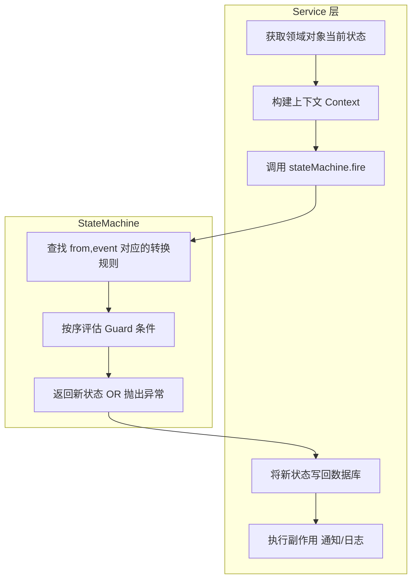

# 泛型状态机（State Machine）设计文档

[toc]

## 概述

状态机是一个可复用的通用组件，用于管理领域对象的状态流转。它提供类型安全的状态转换定义、Guard 条件校验和转换规则执行，适用于活动、订单、组队等需要严格状态管理的业务模块。

**设计目标**：
- **泛型复用**：支持任意枚举类型的 State 和 Event，一套代码多模块共用
- **类型安全**：编译期检查状态和事件类型，杜绝运行时类型错误
- **Guard 内建**：支持带条件的转换规则，运行时根据上下文决定是否允许转换
- **职责单一**：状态机只负责"校验 + 计算新状态"，持久化由调用方负责

## 涉及文件

```
JustGo-backend/src/main/java/com/dyu/justgobackend/
├── common/
│   ├── statemachine/
│   │   ├── StateMachine.java              # 状态机核心引擎
│   │   ├── TransitionRule.java            # 转换规则定义
│   │   ├── TransitionKey.java             # (fromState, event) 复合键
│   │   └── IllegalTransitionException.java # 非法转换异常
│   └── config/
│       └── StateMachineConfig.java        # 各模块状态机 Bean 注册（可选，各模块也可自行注册）
```

---

## 核心概念

### 三个泛型参数

| 参数 | 含义 | 示例 |
|------|------|------|
| `S extends Enum<S>` | 状态枚举 | `ActivityStatus`、`OrderStatus` |
| `E extends Enum<E>` | 事件枚举 | `ActivityEvent`、`OrderEvent` |
| `C` | 上下文类型（Guard 条件入参） | `ActivityContext`、`OrderContext`；无需 Guards 时用 `Void` |

### 转换规则 `TransitionRule<S, C>`

一条转换规则由 4 个要素组成：

```
fromState  ×  event  →  targetState  [ guard(context) ]
```

- **fromState**：当前状态
- **event**：触发事件
- **targetState**：目标状态
- **guard**（可选）：`Predicate<C>`，运行时根据上下文判断是否允许此转换

### 规则匹配逻辑

`(fromState, event)` 构成唯一查找键。同一个键下可以定义多条规则，按**添加顺序**评估：

1. 找到所有匹配 `(fromState, event)` 的规则
2. 按添加顺序依次执行 guard（如有）
3. **第一个 guard 通过的规则**立即命中，返回 targetState
4. 无 guard 的规则视为无条件通过（兜底）
5. 所有规则都不匹配 → 抛出 `IllegalTransitionException`

```
示例：活动报名
  RECRUITING × JOIN → FULL    (guard: participants >= max)  ← 先评估
  RECRUITING × JOIN → RECRUITING  (无 guard, 兜底)          ← 后评估
```

---

## API 设计

### StateMachine 核心方法

```java
public class StateMachine<S extends Enum<S>, E extends Enum<E>, C> {

    /**
     * 执行状态转换。
     * @param from    当前状态
     * @param event   触发事件
     * @param context 上下文（传给 guard，可为 null）
     * @return 转换后的新状态
     * @throws IllegalTransitionException 当 (from, event) 无匹配规则或所有 guard 均拒绝时
     */
    public S fire(S from, E event, C context) throws IllegalTransitionException;

    /**
     * 检查是否可以转换（不实际执行，仅校验规则是否存在且 guard 通过）。
     */
    public boolean canTransition(S from, E event, C context);

    /**
     * 获取指定状态下所有可能的转换目标（用于 UI 展示可操作按钮等）。
     */
    public Map<E, S> availableTransitions(S from);

    /**
     * 创建 Builder。
     */
    public static <S extends Enum<S>, E extends Enum<E>, C> Builder<S, E, C> builder();
}
```

### Builder API

```java
StateMachine<ActivityStatus, ActivityEvent, ActivityContext> sm =
    StateMachine.<ActivityStatus, ActivityEvent, ActivityContext>builder()
        // 基础转换：无 guard，无条件通过
        .add(RECRUITING, CANCEL, CANCELLED)

        // 带 guard 的转换：排在无 guard 规则前面
        .add(RECRUITING, JOIN, FULL, ctx -> ctx.isFull())

        // 兜底转换：同键的默认规则
        .add(RECRUITING, JOIN, RECRUITING)

        .add(FULL, CANCEL, CANCELLED)
        .add(FULL, START, ONGOING)
        .add(RECRUITING, START, ONGOING)
        .add(ONGOING, END, ENDED)
        .add(ONGOING, CANCEL, CANCELLED)
        .build();
```

### Builder 方法签名

```java
public interface Builder<S, E, C> {
    /** 添加一条转换规则。同键多条规则按 add 顺序评估。 */
    Builder<S, E, C> add(S from, E event, S target);
    Builder<S, E, C> add(S from, E event, S target, Predicate<C> guard);
    StateMachine<S, E, C> build();
}
```

### TransitionKey（内部使用）

```java
// 用于 Map 的复合键，不对外暴露
record TransitionKey<S, E>(S fromState, E event) {}
```

### TransitionRule（内部使用）

```java
// 单条转换规则，不对外暴露
record TransitionRule<S, C>(S targetState, @Nullable Predicate<C> guard) {}
```

### IllegalTransitionException

```java
public class IllegalTransitionException extends BusinessException {
    public IllegalTransitionException(S from, E event) {
        super(400, String.format("不允许的状态转换: [%s] --%s--> ?", from, event));
    }

    public IllegalTransitionException(S from, E event, String reason) {
        super(400, String.format("不允许的状态转换: [%s] --%s--> ? 原因: %s", from, event, reason));
    }
}
```

---

## 活动模块使用示例

### 1. 定义状态枚举

```java
public enum ActivityStatus {
    RECRUITING(1, "招募中"),
    FULL(2, "已满员"),
    ONGOING(3, "进行中"),
    ENDED(4, "已结束"),
    CANCELLED(5, "已取消");

    private final int code;
    private final String label;
    // constructor, getters...
}
```

### 2. 定义事件枚举

```java
public enum ActivityEvent {
    JOIN,           // 有人报名
    CANCEL,         // 创建者取消活动
    START,          // 活动开始（定时任务触发）
    END,            // 活动结束（定时任务触发）
}
```

### 3. 定义上下文

```java
public record ActivityContext(
    int currentParticipants,   // 当前报名人数
    int maxParticipants,       // 人数上限
    boolean isCreator          // 是否为创建者
) {
    public boolean isFull() {
        return maxParticipants > 0 && currentParticipants >= maxParticipants;
    }
}
```

### 4. 构建 StateMachine Bean

```java
@Configuration
public class ActivityStateMachineConfig {

    @Bean
    public StateMachine<ActivityStatus, ActivityEvent, ActivityContext> activityStateMachine() {
        return StateMachine.<ActivityStatus, ActivityEvent, ActivityContext>builder()
            // JOIN: 满员→FULL, 未满→保持 RECRUITING
            .add(RECRUITING, JOIN, FULL,
                    ctx -> ctx.isFull())
            .add(RECRUITING, JOIN, RECRUITING)
            // JOIN (从 FULL 恢复报名后不满→回到 RECRUITING)
            .add(FULL, JOIN, RECRUITING,
                    ctx -> !ctx.isFull())

            // CANCEL: 招募中/已满员/进行中均可取消
            .add(RECRUITING, CANCEL, CANCELLED)
            .add(FULL, CANCEL, CANCELLED)
            .add(ONGOING, CANCEL, CANCELLED)

            // START: 活动开始
            .add(RECRUITING, START, ONGOING)
            .add(FULL, START, ONGOING)

            // END: 活动结束
            .add(ONGOING, END, ENDED)

            .build();
    }
}
```

### 5. Service 层调用

```java
@Service
public class ActivityServiceImpl implements ActivityService {

    private final StateMachine<ActivityStatus, ActivityEvent, ActivityContext> stateMachine;

    @Override
    @Transactional
    public void joinActivity(Long activityId) {
        Activity activity = findById(activityId);
        ActivityStatus currentStatus = activity.getStatus();

        // 更新人数
        int newCount = activity.getCurrentParticipants() + 1;
        activity.setCurrentParticipants(newCount);

        // 状态机计算新状态
        ActivityContext ctx = new ActivityContext(
            newCount,
            activity.getMaxParticipants(),
            false
        );
        ActivityStatus newStatus = stateMachine.fire(currentStatus, ActivityEvent.JOIN, ctx);

        // 调用方自行持久化
        activity.setStatus(newStatus);
        activityMapper.updateById(activity);
    }

    @Override
    public void cancelActivity(Long activityId) {
        Activity activity = findById(activityId);
        // 校验是创建者...
        ActivityStatus newStatus = stateMachine.fire(
            activity.getStatus(), ActivityEvent.CANCEL, null);
        activity.setStatus(newStatus);
        activityMapper.updateById(activity);
    }
}
```

### 6. 定时任务调用

```java
@Component
public class ActivityStatusScheduler {

    @Scheduled(cron = "0 */5 * * * ?")
    public void advanceStatus() {
        List<Activity> toStart = activityMapper.findByStatusInAndStartTimeBefore(
            List.of(RECRUITING, FULL), LocalDateTime.now());
        for (Activity a : toStart) {
            ActivityStatus next = stateMachine.fire(a.getStatus(), ActivityEvent.START, null);
            activityMapper.updateStatus(a.getId(), next);
        }

        List<Activity> toEnd = activityMapper.findByStatusAndEndTimeBefore(
            ONGOING, LocalDateTime.now());
        for (Activity a : toEnd) {
            ActivityStatus next = stateMachine.fire(a.getStatus(), ActivityEvent.END, null);
            activityMapper.updateStatus(a.getId(), next);
        }
    }
}
```

---

## 其他模块扩展示例

### 订单模块

```java
// 状态：PENDING → PAID → SHIPPED → DELIVERED → (CANCELLED / REFUNDING → REFUNDED)
public enum OrderStatus { PENDING, PAID, SHIPPED, DELIVERED, CANCELLED, REFUNDING, REFUNDED }
public enum OrderEvent { PAY, SHIP, DELIVER, CANCEL, REQUEST_REFUND, COMPLETE_REFUND }
public record OrderContext(boolean isUnpaid, BigDecimal paidAmount, Long operatorId) {}

StateMachine<OrderStatus, OrderEvent, OrderContext> orderSM =
    StateMachine.<OrderStatus, OrderEvent, OrderContext>builder()
        .add(PENDING, PAY, PAID)
        .add(PENDING, CANCEL, CANCELLED, ctx -> ctx.isUnpaid())
        .add(PAID, SHIP, SHIPPED)
        .add(SHIPPED, DELIVER, DELIVERED)
        .add(PAID, CANCEL, REFUNDING)       // 已支付订单取消 → 进入退款流程
        .add(REFUNDING, COMPLETE_REFUND, REFUNDED)
        .build();
```

### 组队模块

```java
// 状态：OPEN → MATCHED → IN_PROGRESS → COMPLETED → (CANCELLED)
public enum TeamStatus { OPEN, MATCHED, IN_PROGRESS, COMPLETED, CANCELLED }
public enum TeamEvent { MATCH, START, COMPLETE, CANCEL, EXPIRE }
public record TeamContext(int memberCount, int minMembers, boolean isLeader) {}

StateMachine<TeamStatus, TeamEvent, TeamContext> teamSM =
    StateMachine.<TeamStatus, TeamEvent, TeamContext>builder()
        .add(OPEN, MATCH, MATCHED, ctx -> ctx.memberCount() >= ctx.minMembers())
        .add(MATCHED, START, IN_PROGRESS)
        .add(OPEN, CANCEL, CANCELLED, ctx -> ctx.isLeader())
        .add(MATCHED, CANCEL, CANCELLED, ctx -> ctx.isLeader())
        .add(OPEN, EXPIRE, CANCELLED)       // 超时自动取消
        .add(IN_PROGRESS, COMPLETE, COMPLETED)
        .build();
```

---

## 状态机 vs Service 层职责分工



| 职责 | StateMachine | Service 层 |
|------|:--:|:--:|
| 定义"哪些转换合法" | ✅ | |
| 运行时校验 Guard 条件 | ✅ | |
| 查询领域对象当前状态 | | ✅ |
| 构建 Context | | ✅ |
| 持久化新状态 | | ✅ |
| 发送通知 / 记录日志 | | ✅ |
| 触发其他业务逻辑 | | ✅ |

---

## 错误处理

### 场景一：未定义的转换

```java
// 状态机未定义 ENDED × JOIN 的规则
stateMachine.fire(ENDED, ActivityEvent.JOIN, ctx);
// → IllegalTransitionException(400, "不允许的状态转换: [已结束] --报名--> ?")
```

### 场景二：Guard 拒绝

```java
// 当前人数未满，但 FULL→JOIN 的 guard 要求 !isFull()
stateMachine.fire(FULL, ActivityEvent.JOIN, new ActivityContext(3, 10, false));
// → 由于加 RECRUITING 的 guard 要求 !isFull() 且当前 isFull()=false，
//   实际上会走到 FULL+JOIN→RECRUITING 的规则（满员后有人取消，回到招募中）

// 但如果所有 guard 都拒绝：
// → IllegalTransitionException(400, "不允许的状态转换: [已满员] --报名--> ? 原因: Guard 条件不满足")
```

### Service 层处理

```java
try {
    ActivityStatus next = stateMachine.fire(current, event, ctx);
    activity.setStatus(next);
} catch (IllegalTransitionException e) {
    // 转换为用户可读的业务异常
    throw new BusinessException(400, "当前状态不允许此操作");
}
```

---

## 设计决策记录

| 决策 | 结论 | 理由 |
|------|------|------|
| 泛型参数数量 | `<S, E, C>` 三个 | S 和 E 类型安全，C 灵活支持有/无上下文场景 |
| Guard 内置 | 支持 `Predicate<C>` | 条件判断是状态模型的一部分，放在状态机中保持规则集中 |
| 持久化职责 | 调用方负责 | 保持状态机纯净，不与存储层耦合 |
| 同键多条规则 | 支持，按序评估 | 支持有 guard 的规则在前、无 guard 兜底在后的模式 |
| 副作用 | 不支持（无 Action 回调） | 副作用（通知、日志）放 Service 层，状态机保持确定性 |
| 事件类型 | 强类型枚举 | 编译期检查，IDE 补全，杜绝拼写错误 |

---

## 未解决的问题

### P2

#### 1. 无状态转换历史记录

当前状态机是无状态的，不记录每次转换的轨迹。如果需要审计"活动经历了哪些状态变化"，需要在 Service 层额外建日志表记录。

**建议**：Phase 2 评估是否需要 `status_change_log` 表，记录 `(entity_type, entity_id, from_status, to_status, event, operator_id, created_at)`。

#### 2. 无分布式场景下的状态一致性保障

高并发下可能出现状态机认为可以转换，但 DB 更新时发现状态已被其他请求改变（Lost Update）。

**建议**：Service 层更新状态时用乐观锁 `UPDATE ... SET status = ? WHERE id = ? AND status = ?`，affected rows = 0 时重试或报错。

---

## 验证清单

- [ ] `mvn test` 全部通过
- [ ] `StateMachine` 单元测试覆盖：
  - [ ] 正常转换返回正确 targetState
  - [ ] Guard 通过 / 拒绝
  - [ ] 同键多条规则按序评估
  - [ ] 未定义转换抛出 IllegalTransitionException
  - [ ] `canTransition` 返回正确布尔值
  - [ ] `availableTransitions` 返回正确映射
- [ ] 活动模块集成：`ActivityServiceImpl` 通过状态机管理状态流转
